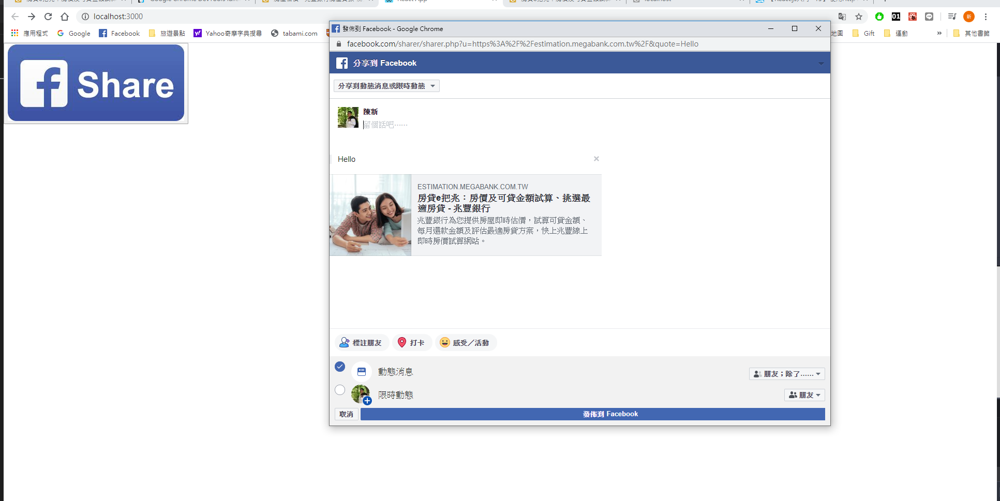
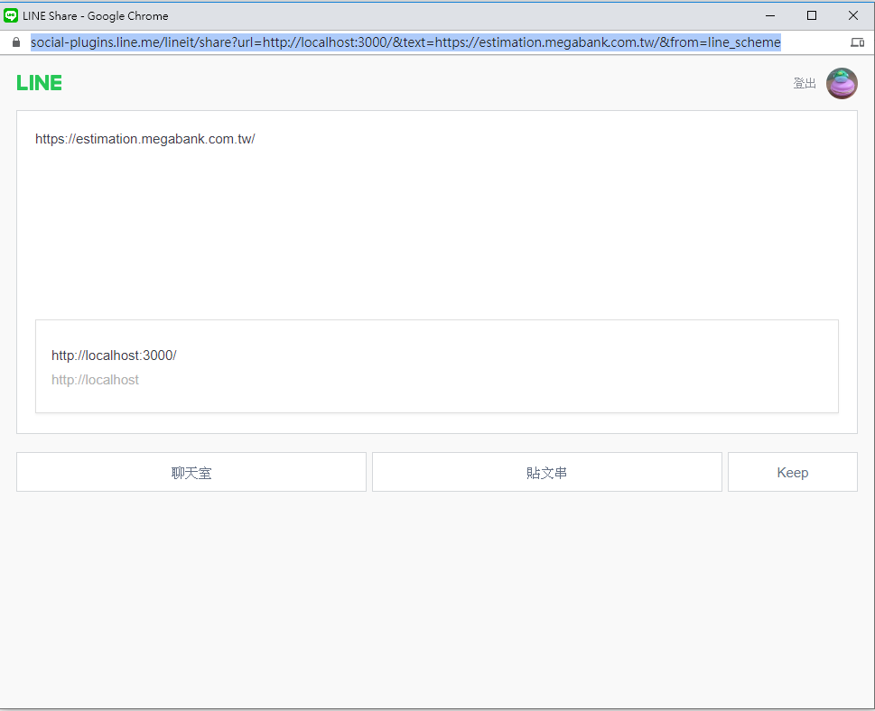
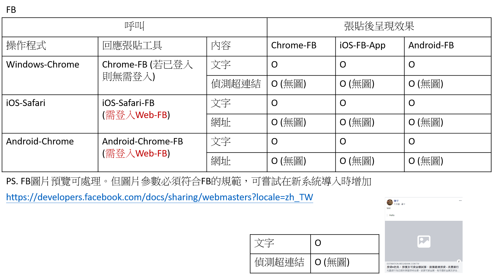

npm install
npm start

目前預計送出的功能是推廣網頁 

功能目標設計: 
一段文字+網站連結 

FB share  
狀況：不需申請 FB appid 

電腦版本 
顯示：點按鈕後可開啟新視窗 
登入：取用 FB 網頁版本資訊 (使用者必須登入) 

手機版本 
顯示：點按鈕後可開啟新視窗 
登入：取用 FB 網頁版本資訊，不與 App 連動 

===============================================================

Line share  
狀況：不需申請 Line Appid，可點擊後產生網頁頁籤 

電腦版本 
顯示：開啟新視窗，會自動將文字網址轉成連結 & 自動增加 起源網址 (例：http://localhost:3000/  是本次 react 的網站) 
登入：需要登入 line 帳號，沒跟 電腦 Line App / Chrome-line plugin 連動 

點擊跳出新畫面(需主動登入)，會再附上一條 http://localhost:3000/ (連結產生網站) 

產出畫面： 
Windows (程式 v5.21.3) 

Windows (Chrome-Plugin)(不自動生成預覽) 

iOS Line App 

Mac Line App(不自動生成預覽) 

Android Line (缺)  

手機版本 
顯示：跳轉到 line App 工具 

登入： 
Android (缺) 
iOS:手機 line app 

產出畫面： 
iOS 手機 

Windows app 

Windows line (chrome-plugin) 

===============================================================

更新整理目錄

